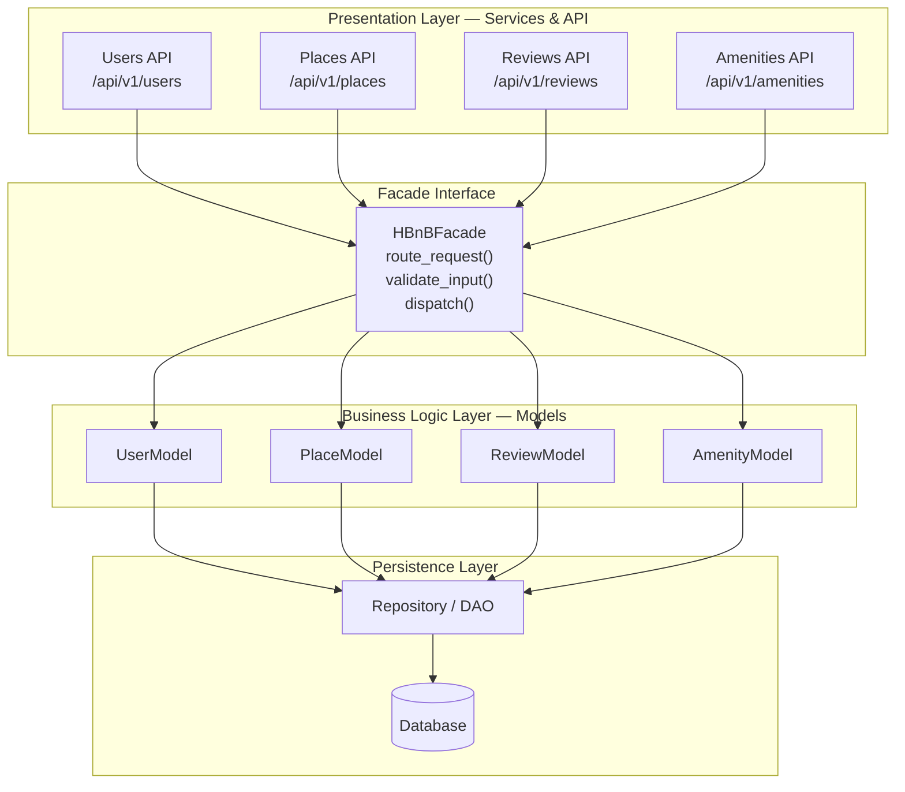

# High-Level Package Diagram

## Overview

This diagram illustrates the three-layer architecture of HBnB Evolution and how the layers communicate through the **Facade pattern**.

## Layer Descriptions

### Presentation Layer
Handles all HTTP interactions with the outside world. Exposes four RESTful endpoint groups (`/users`, `/places`, `/reviews`, `/amenities`). Responsible for parsing requests, enforcing authentication tokens, and serializing responses. It contains **no business logic**.

### Facade Interface
The single entry-point between Presentation and Business Logic. It routes every incoming call, performs input coercion, and shields the API layer from knowing which internal service handles a request. Adding or replacing a service never requires changes in the API controllers.

### Business Logic Layer
Contains the four domain models — `UserModel`, `PlaceModel`, `ReviewModel`, `AmenityModel` — together with their validation rules, state transitions, and inter-entity relationships. This layer is the authoritative source of business rules.

### Persistence Layer
The `Repository / DAO` abstraction decouples the domain models from any specific database technology. In Part 1 data is in-memory; Part 3 introduces a relational database. Because models only talk to the Repository interface, swapping storage engines requires no changes to business logic.

## How the Facade Pattern Works Here

1. An API controller receives an HTTP request and calls `HBnBFacade.route_request()`.
2. The Facade validates and dispatches to the appropriate model (e.g., `UserModel.register()`).
3. The model applies business rules, then reads or writes through the Repository.
4. The result travels back up the same chain and is serialized by the API controller.

This guarantees **strict layer separation**: no layer skips another, and each layer has one well-defined responsibility.
