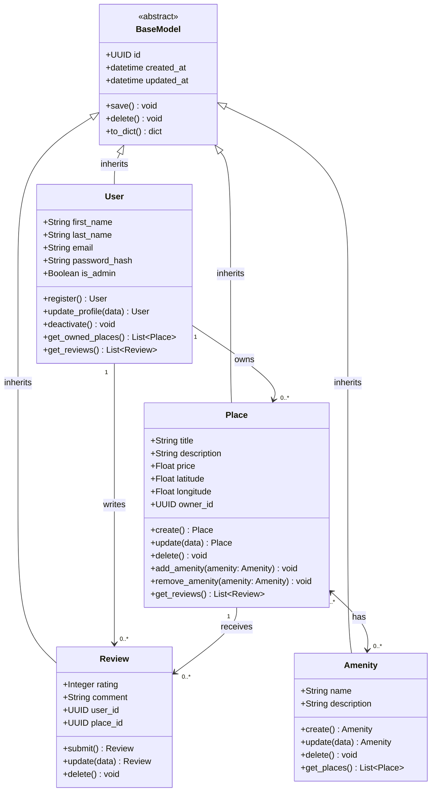

# Business Logic Layer — Class Diagram

## Overview

This diagram covers all four domain entities (`User`, `Place`, `Review`, `Amenity`) together with the shared `BaseModel` they inherit from. Attributes, methods, multiplicities, and relationship types are all shown.

## Entity Descriptions

### BaseModel *(abstract)*
Every entity inherits from `BaseModel`. It guarantees:
- **`id`** — UUID4, generated on creation; unique across all entities.
- **`created_at`** / **`updated_at`** — ISO-8601 datetimes for full audit trail.
- **`save()`** — persists the current state through the Repository.
- **`delete()`** — removes the record and cascades where applicable.
- **`to_dict()`** — serializes the object for API responses.

### User
Represents a registered account. `is_admin` grants elevated privileges (amenity management, moderation). Passwords are never stored in plain text — only a `password_hash` is persisted. Key behaviors: `register()` validates uniqueness of `email`; `update_profile()` prevents e-mail conflicts; `deactivate()` performs a soft-delete.

### Place
A property listing created and owned by a `User`. `latitude` / `longitude` are validated to real geographic ranges. `price` must be a positive float. `add_amenity()` / `remove_amenity()` manage the many-to-many join with `Amenity`. `delete()` cascades to all associated `Review` records.

### Review
Links a `User` to a `Place` with a 1–5 integer `rating` and a free-text `comment`. Business rules enforced by `submit()`: the author must not be the place owner, and duplicate reviews (same user + place) are rejected.

### Amenity
A reusable tag that can be attached to many places (e.g., "Wi-Fi", "Pool"). Created and managed by admins. `get_places()` returns every `Place` currently advertising this amenity.

## Relationships

| Relationship | Type | Multiplicity | Description |
|---|---|---|---|
| `BaseModel` → each entity | Inheritance | 1 : 1 | Shared identity + audit fields |
| `User` → `Place` | Association | 1 : 0..* | A user owns zero or more places |
| `User` → `Review` | Association | 1 : 0..* | A user writes zero or more reviews |
| `Place` → `Review` | Association | 1 : 0..* | A place receives zero or more reviews |
| `Place` ↔ `Amenity` | Association (many-to-many) | 0..* : 0..* | A place has many amenities; an amenity appears on many places |
