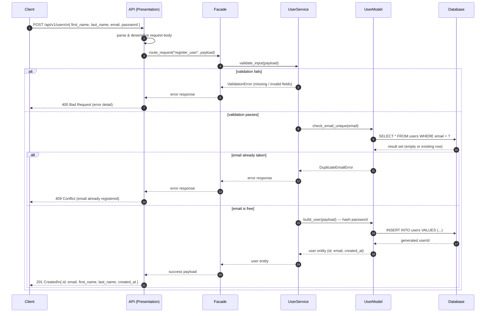

# Sequence Diagram — User Registration

## Purpose

Shows the end-to-end flow when a new user submits a `POST /api/v1/users` request, from HTTP receipt through validation, persistence, and final response.

## Diagram

## Step-by-Step Explanation

| Step | Actor | Action |
|---|---|---|
| 1 | Client | Sends `POST /api/v1/users` with registration fields in the JSON body. |
| 2 | API | Parses and deserializes the request body into an internal data transfer object. |
| 3 | API → Facade | Delegates to `HBnBFacade.route_request()` — the Presentation layer has no business logic. |
| 4 | Facade → Service | `UserService.validate_input()` checks required fields, data types, and format rules (e.g. valid e-mail pattern, password length). |
| 5a | (alt) | If validation fails, a `400 Bad Request` is returned immediately. |
| 5b | Service → Model | Queries the database to ensure the e-mail address is not already registered. |
| 6a | (alt) | If the e-mail is taken, a `409 Conflict` is returned. |
| 6b | Service → Model | `build_user()` applies bcrypt hashing to the plain-text password. The hash — never the raw password — is persisted. |
| 7 | Model → DB | Issues an `INSERT` and receives the auto-generated `userId`. |
| 8 | DB → Client | The new user entity travels back up through Model → Service → Facade → API, and a `201 Created` response is returned. |

## Key Design Decisions

- **Password hashing in the model layer** — business logic is responsible for security rules; the API layer never touches the raw password after passing it down.
- **Email uniqueness check before insert** — avoids a database-level unique-constraint exception being surfaced to the user without a helpful message.
- **No authentication token on registration** — the client must perform a separate login call to obtain a token (separation of concerns).
