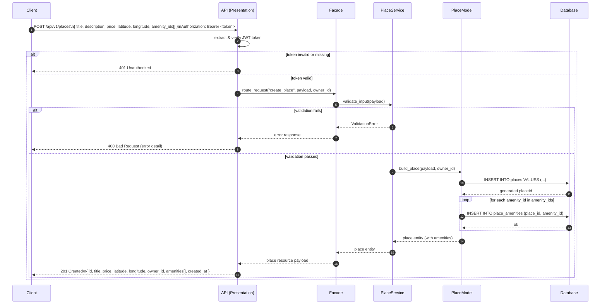

# Sequence Diagram — Place Creation

## Purpose

Illustrates the flow when an authenticated user submits a `POST /api/v1/places` request to list a new property. Authentication, ownership assignment, and persistence are all covered.

## Diagram

## Step-by-Step Explanation

| Step | Actor | Action |
|---|---|---|
| 1 | Client | Sends `POST /api/v1/places` with place fields plus an optional list of `amenity_ids`. |
| 2 | API | Extracts the JWT from the `Authorization` header and verifies the signature. If invalid → `401`. |
| 3 | API → Facade | Passes the validated payload **and** the `owner_id` derived from the token (never from the request body). |
| 4 | Facade → Service | `PlaceService.validate_input()` checks: `price > 0`, latitude ∈ [-90, 90], longitude ∈ [-180, 180], non-empty `title`. |
| 5a | (alt) | Validation failure returns `400` with field-level error messages. |
| 5b | Service → Model | `build_place()` constructs the entity with `owner_id` injected from the authenticated session. |
| 6 | Model → DB | Inserts the place row; receives the generated `placeId`. |
| 7 | Model → DB | For each `amenity_id`, inserts a row in the `place_amenities` join table. |
| 8 | DB → Client | The full place entity (with resolved amenities list) flows back up and a `201 Created` is returned. |

## Key Design Decisions

- **Owner is set server-side** — the `owner_id` comes from the verified JWT, not the request body, preventing users from spoofing ownership.
- **Amenities attached in the same request** — a single API call creates the place and associates its amenities, reducing round-trips for the client.
- **Coordinate range validation** — enforced at the service layer before any database writes, keeping invalid data out of storage entirely.
