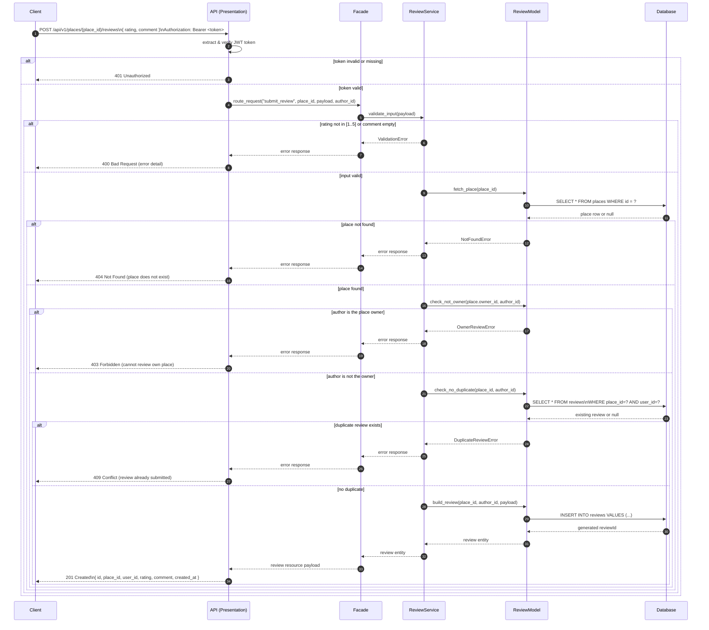

# Sequence Diagram — Review Submission
 
## Purpose
 
Covers the flow when an authenticated user submits a `POST /api/v1/reviews` request for a specific place. Highlights the duplicate-review guard and the owner-cannot-review-own-place rule.
 
## Diagram
 

 
## Step-by-Step Explanation
 
| Step | Actor | Action |
|---|---|---|
| 1 | Client | Sends `POST /api/v1/places/{place_id}/reviews` with `rating` (1–5) and `comment`. |
| 2 | API | Verifies the JWT; rejects with `401` if missing or expired. |
| 3 | API → Facade | Routes to `ReviewService` with the place ID and the `author_id` from the token. |
| 4 | Facade → Service | Validates `rating` ∈ [1, 5] and `comment` is non-empty. |
| 5 | Service → DB | Confirms the target place actually exists; returns `404` if not. |
| 6 | Service → Model | Checks that the review author is **not** the place owner (`403` if so). |
| 7 | Service → DB | Checks for an existing review from this user for this place (`409` if found). |
| 8 | Model → DB | Inserts the review row; receives `reviewId`. |
| 9 | DB → Client | Review entity travels back up; `201 Created` is returned. |
 
## Key Design Decisions
 
- **Owner-cannot-review rule** — enforced in the service layer before any write; prevents fraudulent self-promotion of listings.
- **One-review-per-user-per-place** — a database query guard prevents rating manipulation through multiple submissions.
- **Nested route** (`/places/{place_id}/reviews`) — the place context is part of the URL, making it impossible to accidentally omit `place_id` from the request.
