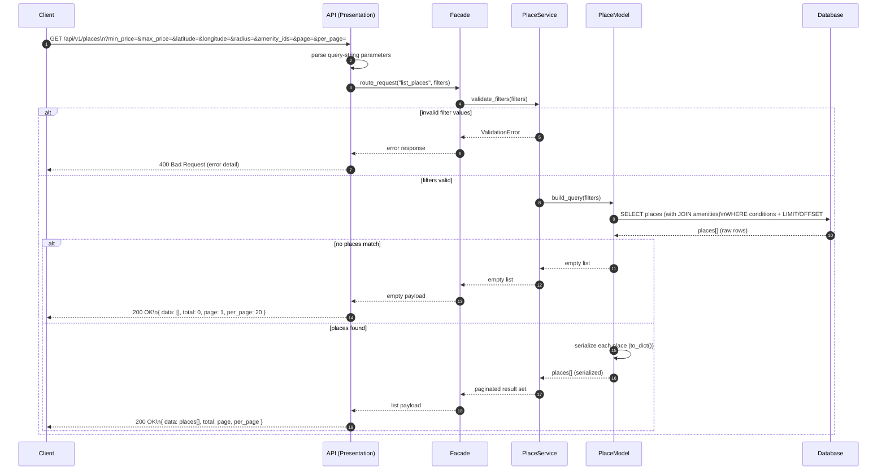

# Sequence Diagram — Fetching a List of Places

## Purpose

Describes the read flow when a client issues a `GET /api/v1/places` request with optional query-string filters. Shows filter validation, query construction, and paginated response handling.

## Diagram

## Supported Query Parameters

| Parameter | Type | Description |
|---|---|---|
| `min_price` | Float | Minimum nightly price (inclusive) |
| `max_price` | Float | Maximum nightly price (inclusive) |
| `latitude` | Float | Centre latitude for geo-radius search |
| `longitude` | Float | Centre longitude for geo-radius search |
| `radius` | Float | Search radius in km (requires lat/lon) |
| `amenity_ids` | UUID list | Filter to places offering all listed amenities |
| `page` | Integer | Page number (default: 1) |
| `per_page` | Integer | Results per page (default: 20, max: 100) |

## Step-by-Step Explanation

| Step | Actor | Action |
|---|---|---|
| 1 | Client | Issues `GET /api/v1/places` with any combination of optional filters. |
| 2 | API | Parses the query string into a typed filter object (no business logic). |
| 3 | API → Facade | Delegates to `PlaceService` via `HBnBFacade.route_request()`. |
| 4 | Facade → Service | `validate_filters()` checks numeric ranges, co-dependent parameters (lat/lon required if radius present), and pagination bounds. |
| 5a | (alt) | Invalid filter values return `400` with field-level error messages. |
| 5b | Service → Model | `build_query()` constructs the SQL `WHERE` clause and `JOIN` conditions dynamically. |
| 6 | Model → DB | Executes `SELECT` with `LIMIT` / `OFFSET` for pagination; joins the amenities table to resolve amenity names. |
| 7a | (alt) | If no rows match, an empty `data: []` response is returned with `200 OK` (not `404`). |
| 7b | Model | `to_dict()` is called on each entity before returning, stripping internal fields. |
| 8 | DB → Client | Paginated payload with `total`, `page`, and `per_page` metadata flows back; `200 OK` is returned. |

## Key Design Decisions

- **All filters are optional** — a request with no query parameters returns all places (paginated), making the endpoint flexible for both browsing and filtered search.
- **Empty result is 200, not 404** — "no places found" is a valid, expected outcome of a search; `404` would be semantically incorrect.
- **Pagination enforced server-side** — `per_page` is capped at 100 to protect database and network performance.
- **Authentication not required** — place listings are public; no token is needed, lowering the barrier for anonymous browsing.
