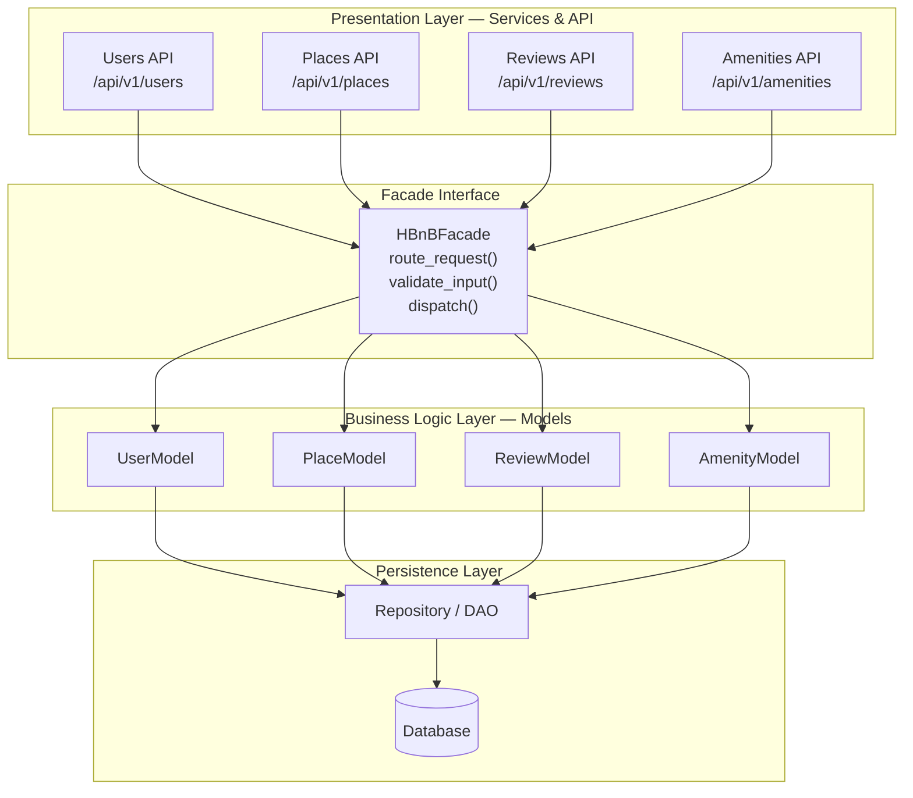
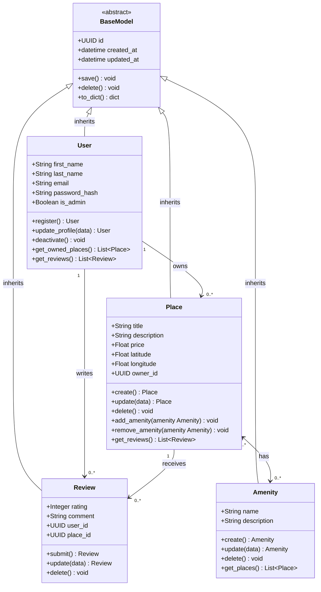
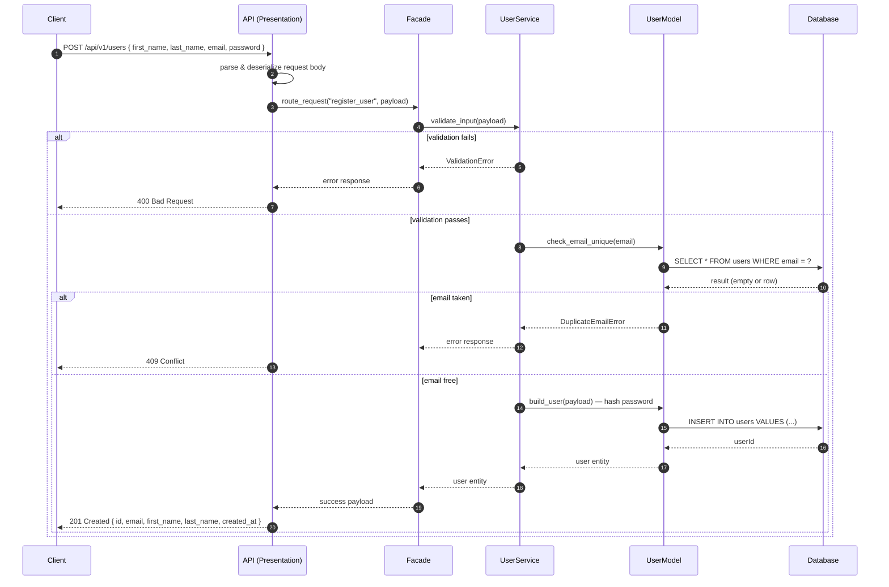
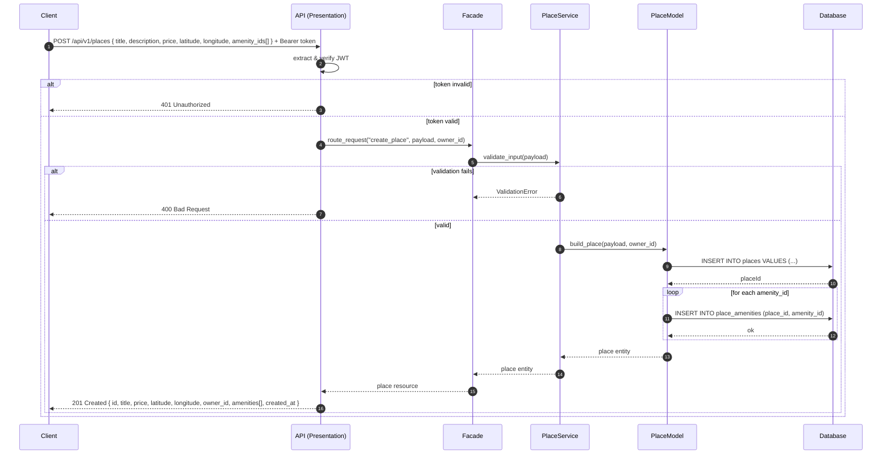
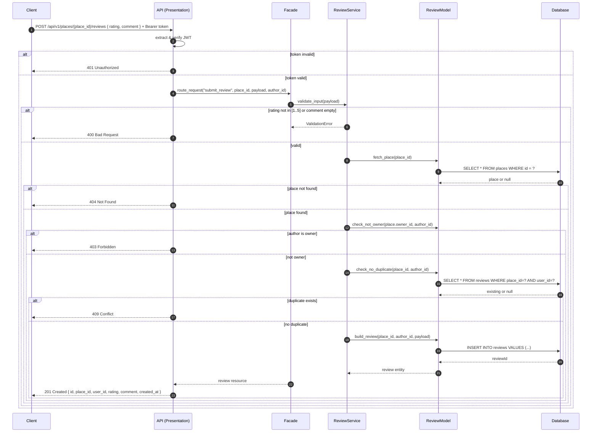
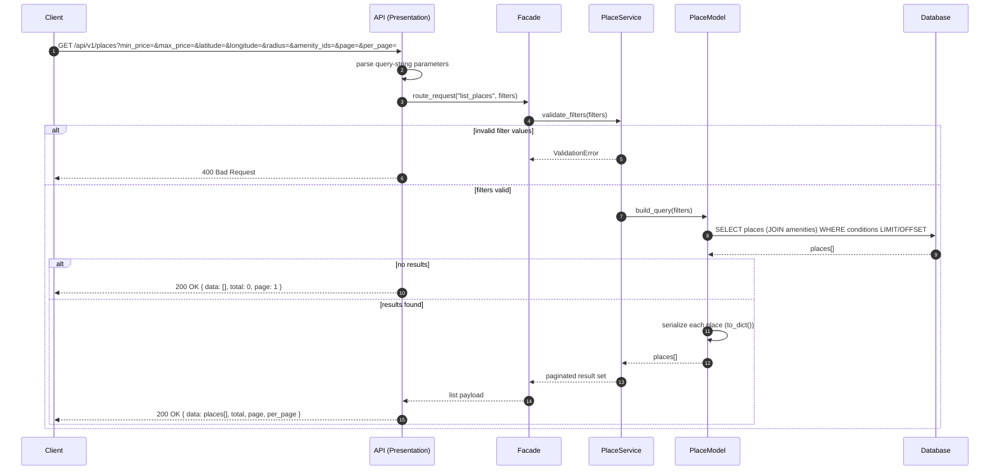

# HBnB Evolution — Technical Documentation
 
> **Project:** HBnB Evolution (Holberton School)
> **Phase:** Part 1 — Architecture & Design Documentation
> **Authors:** Abdallah Kriaa
> **Date:** 2025
 
---
 
## Table of Contents
 
1. [Introduction](#1-introduction)
2. [High-Level Architecture](#2-high-level-architecture)
3. [Business Logic Layer — Class Diagram](#3-business-logic-layer--class-diagram)
4. [API Interaction Flows — Sequence Diagrams](#4-api-interaction-flows--sequence-diagrams)
   - 4.1 [User Registration](#41-user-registration)
   - 4.2 [Place Creation](#42-place-creation)
   - 4.3 [Review Submission](#43-review-submission)
   - 4.4 [Fetching a List of Places](#44-fetching-a-list-of-places)
5. [Design Decisions Summary](#5-design-decisions-summary)
---
 
## 1. Introduction
 
### Project Overview
 
**HBnB Evolution** is a simplified Airbnb-like web application built as part of the Holberton School curriculum. It allows users to register accounts, list properties, associate amenities with those properties, and leave reviews. Administrators have elevated privileges for managing shared resources such as amenities.
 
The application is developed incrementally across three parts:
 
| Part | Focus |
|---|---|
| Part 1 | Architecture and design documentation (this document) |
| Part 2 | Core API implementation with in-memory persistence |
| Part 3 | Persistent storage, authentication, and deployment |
 
### Purpose of This Document
 
This document is the **authoritative technical blueprint** for Part 1. It captures:
 
- The three-layer architecture and the Facade pattern that connects the layers.
- A detailed class model of the four core domain entities.
- Sequence diagrams for the four primary API interactions.
- The rationale behind key design decisions.
All diagrams use **Mermaid.js** notation for version-control compatibility and easy iteration.
 
---
 
## 2. High-Level Architecture
 
### Architecture Diagram
 

 
### Layer Responsibilities
 
#### Presentation Layer
Handles all HTTP I/O. Exposes four RESTful endpoint groups, parses request payloads, enforces JWT authentication where required, and serializes responses. Contains **zero business logic**.
 
#### Facade Interface (`HBnBFacade`)
The single controlled gateway between Presentation and Business Logic. Responsibilities:
- Route each incoming call to the correct service.
- Perform initial input coercion.
- Shield API controllers from internal service topology changes.
Adding or replacing a service never requires changes to the API controllers.
 
#### Business Logic Layer
The four domain models (`UserModel`, `PlaceModel`, `ReviewModel`, `AmenityModel`) together with their validation rules, state transitions, and inter-entity relationships. This layer is the **authoritative source of all business rules**.
 
#### Persistence Layer
The `Repository / DAO` abstraction decouples domain models from any specific database technology. In Part 2, data is in-memory. In Part 3, a relational database is introduced. Because models only talk to the Repository interface, swapping storage engines requires no changes to business logic.
 
### How the Facade Pattern Works
 
```
Client HTTP Request
       │
       ▼
   API Controller  ──►  HBnBFacade.route_request()
                                │
                    ┌───────────┼───────────┐
                    ▼           ▼           ▼
               UserModel   PlaceModel   ReviewModel  …
                    │
                    ▼
              Repository.save() / find() / delete()
                    │
                    ▼
                Database
```
 
1. An API controller receives an HTTP request and calls `HBnBFacade.route_request()`.
2. The Facade validates and dispatches to the appropriate model.
3. The model applies business rules, then reads or writes through the Repository.
4. Results travel back up the same chain and are serialized by the API controller.
**Benefit:** strict layer separation — no layer skips another, each has one responsibility.
 
---
 
## 3. Business Logic Layer — Class Diagram
 
### Diagram
 

 
### Entity Descriptions
 
#### BaseModel *(abstract)*
All four entities extend `BaseModel`. It provides:
- `id` — UUID4, generated at creation; globally unique.
- `created_at` / `updated_at` — ISO-8601 timestamps for a full audit trail.
- `save()` — persists state through the Repository.
- `delete()` — removes the record (cascades where specified).
- `to_dict()` — serializes for API responses.
#### User
Registered accounts. `is_admin` grants elevated privileges. `password_hash` stores only the bcrypt hash — the plain-text password is never persisted. Business rules: `register()` enforces email uniqueness; `update_profile()` re-validates email on change; `deactivate()` performs a soft-delete (data is retained for audit purposes).
 
#### Place
A property listing created and owned by a `User`. Business rules: `price` must be positive; `latitude` ∈ [-90, 90]; `longitude` ∈ [-180, 180]. `add_amenity()` / `remove_amenity()` manage the many-to-many join. Deleting a place cascades to all its reviews.
 
#### Review
Links a `User` to a `Place`. Business rules enforced by `submit()`: (1) the author must not be the place owner; (2) a user cannot submit more than one review per place. `rating` is a 1–5 integer; `comment` is free text (non-empty).
 
#### Amenity
A reusable tag (e.g., "Wi-Fi", "Pool") managed by admins and attachable to many places. `get_places()` returns all places currently advertising this amenity.
 
### Relationship Summary
 
| Relationship | Type | Multiplicity | Rationale |
|---|---|---|---|
| `BaseModel` → all entities | Inheritance | 1:1 | Shared identity and audit fields — avoid code duplication |
| `User` → `Place` | Association | 1:0..* | A user may own zero or more places |
| `User` → `Review` | Association | 1:0..* | A user may write zero or more reviews |
| `Place` → `Review` | Association | 1:0..* | A place may receive zero or more reviews |
| `Place` ↔ `Amenity` | Many-to-many | 0..*:0..* | A place has many amenities; an amenity appears on many places |
 
---
 
## 4. API Interaction Flows — Sequence Diagrams
 
**Common participants across all diagrams:**
 
| Symbol | Represents |
|---|---|
| `Client` | Any HTTP client (browser, mobile app, curl) |
| `API` | Presentation Layer — Flask/REST controllers |
| `Facade` | `HBnBFacade` — routing and dispatch |
| `Service` | Domain service within the Business Logic Layer |
| `Model` | Domain model entity |
| `DB` | Persistence Layer — Repository / Database |
 
---
 
### 4.1 User Registration
 
**Endpoint:** `POST /api/v1/users`
 

 
**Key steps:** Input validation → email uniqueness check → password hashing → DB insert → `201 Created`.
 
**Notable rules:**
- Password is hashed in the model layer; the API layer never touches the raw value after passing it down.
- No authentication token is issued on registration — a separate login call is required.
---
 
### 4.2 Place Creation
 
**Endpoint:** `POST /api/v1/places` *(requires authentication)*
 

 
**Key steps:** JWT verification → input validation → place insert → amenity join inserts → `201 Created`.
 
**Notable rules:**
- `owner_id` is extracted from the JWT server-side; it is never trusted from the request body.
- Coordinates are validated against legal geographic ranges before any write.
---
 
### 4.3 Review Submission
 
**Endpoint:** `POST /api/v1/places/{place_id}/reviews` *(requires authentication)*
 

 
**Key steps:** JWT → validation → place existence check → owner guard → duplicate guard → insert → `201 Created`.
 
**Notable rules:**
- Owners cannot review their own places (`403`).
- One review per user per place (`409`).
---
 
### 4.4 Fetching a List of Places
 
**Endpoint:** `GET /api/v1/places` *(public — no authentication required)*
 

 
**Key steps:** Filter validation → dynamic query build → paginated DB fetch → `200 OK`.
 
**Notable rules:**
- All filters are optional — no query parameters returns all places (paginated).
- An empty result is `200 OK`, not `404`.
- `per_page` is capped at 100 server-side for performance protection.
- No authentication needed — listings are public.
---
 
## 5. Design Decisions Summary
 
| Decision | Rationale |
|---|---|
| **Facade pattern as the inter-layer gateway** | Prevents direct coupling between API controllers and domain models; future changes to internal service topology require no changes in the API layer. |
| **BaseModel with UUID4 + audit timestamps** | All entities share a common identity mechanism and audit fields; eliminates repetition and ensures consistency across the data model. |
| **Password hashing in the model layer** | Security rules are business logic, not presentation logic. The raw password never travels below the service boundary. |
| **Owner ID derived from JWT, never the request body** | Prevents client-side spoofing of ownership. The server is the authoritative source of the authenticated identity. |
| **Owner-cannot-review rule enforced before DB write** | Avoids a class of fraudulent listings where owners inflate their own ratings. |
| **One-review-per-user-per-place check before insert** | Prevents rating manipulation via repeated submissions without relying solely on a database unique constraint for the error message. |
| **Empty list returns 200, not 404** | `404` is semantically reserved for "resource not found"; returning zero results from a search is a valid, expected outcome. |
| **Repository / DAO abstraction in the Persistence Layer** | Decouples domain models from the database technology. In-memory storage in Part 2 can be swapped for SQLAlchemy in Part 3 with no changes to business logic. |
 
---
 
*End of technical documentation — HBnB Evolution, Part 1.*
