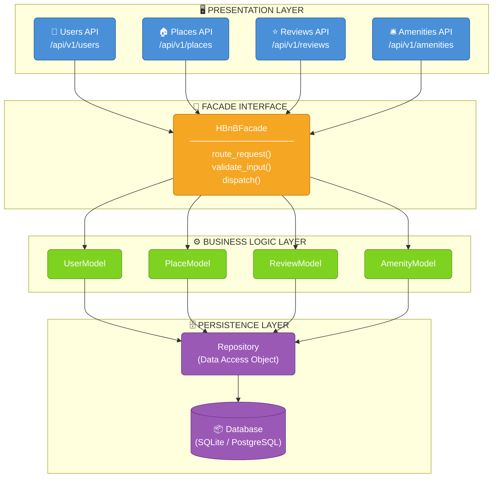
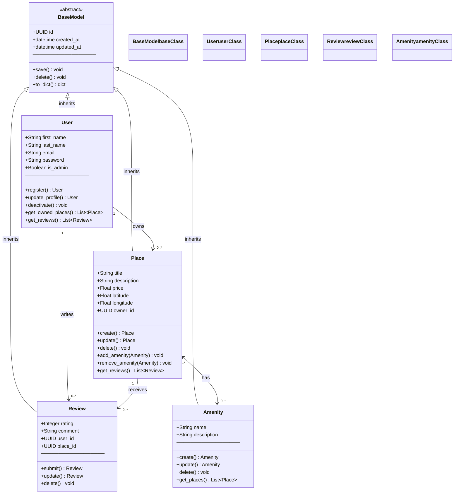
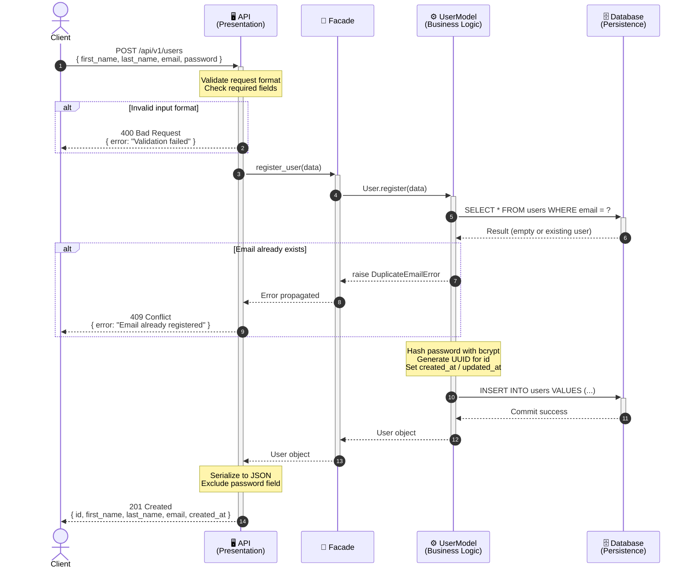
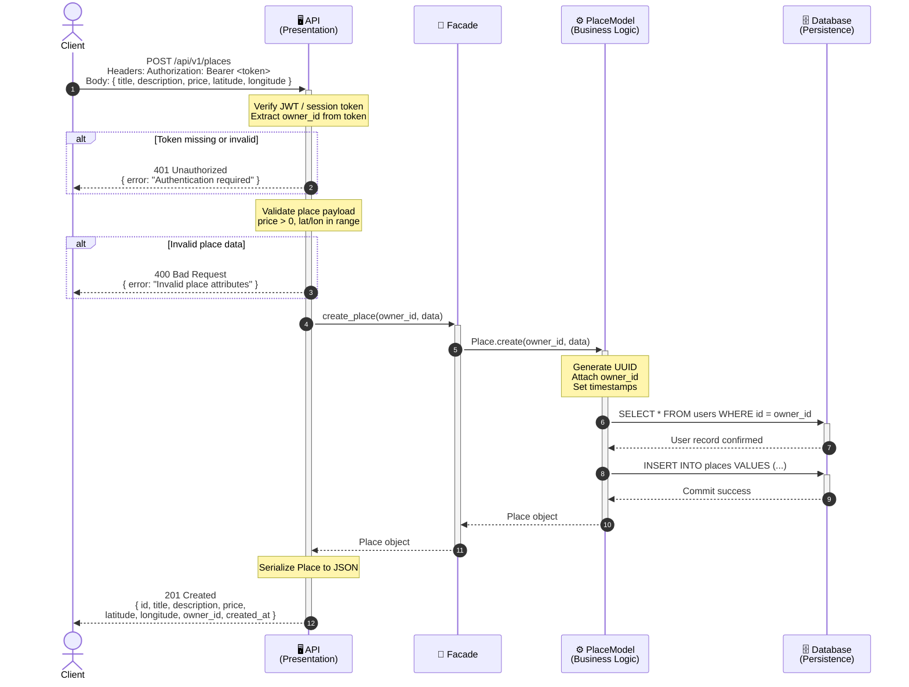
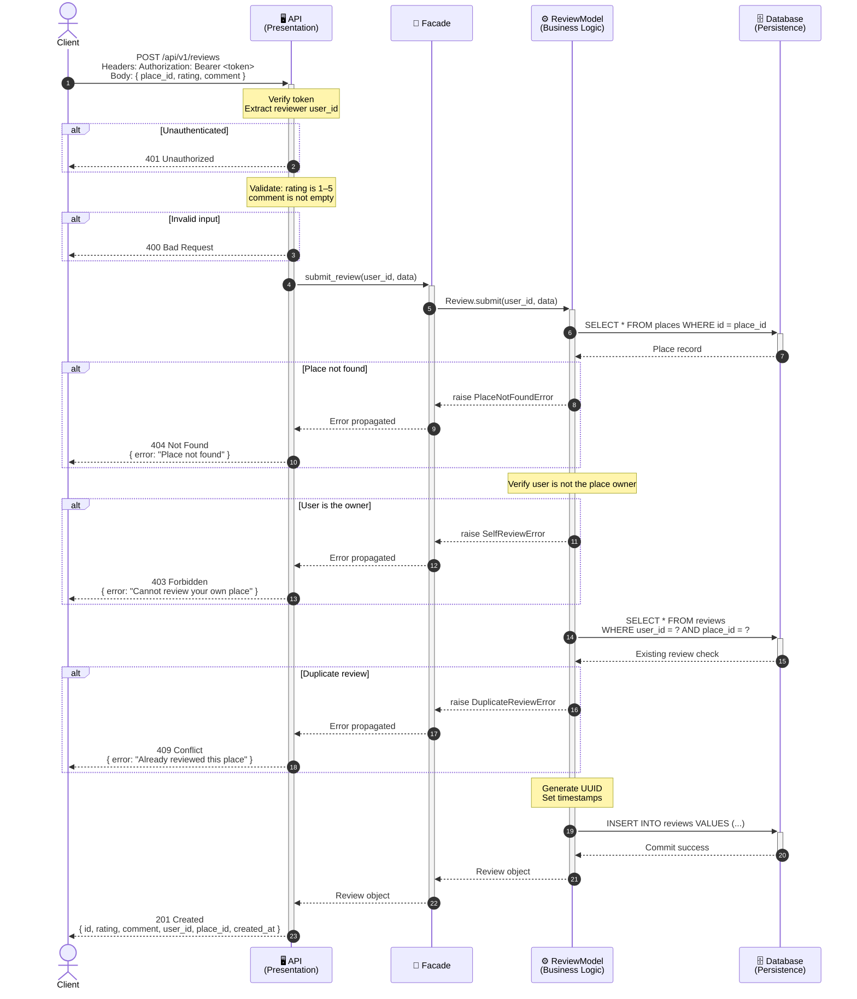
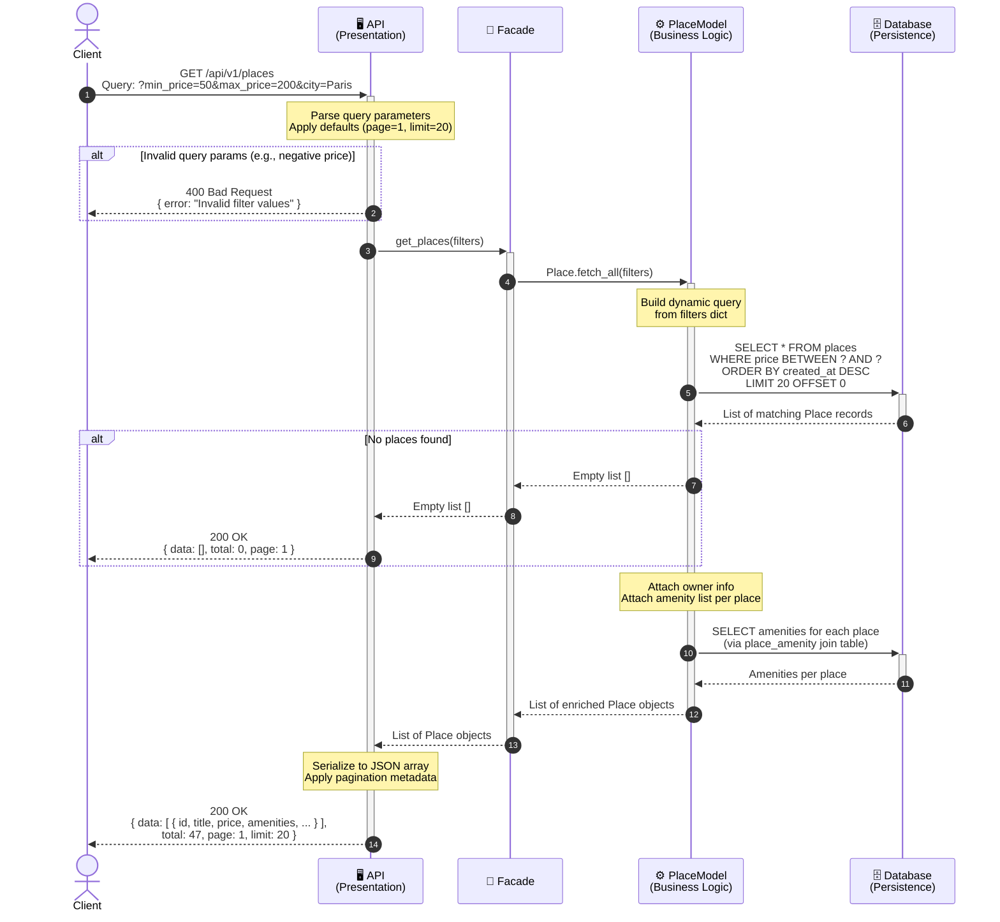

# HBnB Evolution — Technical Documentation

> **Project:** HBnB Evolution (Airbnb-like Application)
> **Document Type:** Comprehensive Architecture & Design Reference
> **Version:** 1.0
> **Purpose:** Blueprint for implementation phases — covers system architecture, business logic design, and API interaction flows.

---

## Table of Contents

1. [Introduction](#1-introduction)
2. [High-Level Architecture](#2-high-level-architecture)
3. [Business Logic Layer — Class Diagram](#3-business-logic-layer--class-diagram)
4. [API Interaction Flows — Sequence Diagrams](#4-api-interaction-flows--sequence-diagrams)
   - 4A. [User Registration](#4a-user-registration)
   - 4B. [Place Creation](#4b-place-creation)
   - 4C. [Review Submission](#4c-review-submission)
   - 4D. [Fetch Places](#4d-fetch-places)
5. [Design Decisions & Rationale](#5-design-decisions--rationale)

---

## 1. Introduction

### 1.1 Project Overview

**HBnB Evolution** is a simplified, full-stack web application modeled after Airbnb. It enables users to list properties (places), browse listings, attach amenities, and submit reviews. The application is designed with a clean, layered architecture that separates concerns across the Presentation, Business Logic, and Persistence layers.

### 1.2 Purpose of This Document

This document serves as the **authoritative technical blueprint** for the HBnB Evolution project. It consolidates all architectural decisions, data models, and interaction flows into a single reference to:

- Guide developers during implementation.
- Establish shared vocabulary and naming conventions.
- Document design decisions and their rationale.
- Provide visual representations of system structure and behavior.

### 1.3 Scope

The document covers:
- **High-Level Architecture** — the three-tier layered model and Facade pattern.
- **Business Logic** — entity definitions, attributes, methods, and relationships.
- **API Interaction Flows** — four key operations described as sequence diagrams.

### 1.4 Core Entities Summary

| Entity   | Key Attributes                                       | Key Relationships              |
|----------|------------------------------------------------------|-------------------------------|
| User     | id, first_name, last_name, email, password, is_admin | Owns Places, Writes Reviews    |
| Place    | id, title, description, price, latitude, longitude   | Owned by User, Has Amenities   |
| Review   | id, rating, comment                                  | Belongs to User and Place      |
| Amenity  | id, name, description                                | Many-to-many with Place        |

> All entities include `id` (UUID4), `created_at`, and `updated_at` timestamps.

---

## 2. High-Level Architecture

### 2.1 Overview

HBnB Evolution follows a **three-tier layered architecture**:

- **Presentation Layer** — Exposes RESTful API endpoints consumed by clients. Handles HTTP requests, serialization, and response formatting.
- **Business Logic Layer** — Contains all application models and business rules. Accessed exclusively through a **Facade** interface that decouples the API from internal logic.
- **Persistence Layer** — Responsible for all database operations: querying, storing, updating, and deleting records.

### 2.2 Facade Pattern

The Facade pattern is applied between the Presentation and Business Logic layers. Rather than having API routes call model classes directly, they communicate through a single `HBnBFacade` interface. This:
- Reduces coupling between layers.
- Makes the API layer unaware of internal model complexity.
- Simplifies testing by allowing the facade to be mocked independently.

### 2.3 Diagram

### 2.4 Layer Responsibilities

| Layer              | Color  | Responsibility                                                     |
|--------------------|--------|--------------------------------------------------------------------|
| Presentation       | Blue   | HTTP request/response handling, input serialization, routing       |
| Facade             | Orange | Single entry-point between API and models, dispatches operations   |
| Business Logic     | Green  | Domain rules, entity validation, relationship management           |
| Persistence        | Purple | CRUD operations, ORM mapping, database transactions                |

---

## 3. Business Logic Layer — Class Diagram

### 3.1 Overview

The Business Logic Layer contains four primary entity classes, all inheriting from a shared `BaseModel`. This base class encapsulates universal attributes (`id`, `created_at`, `updated_at`) and lifecycle methods (`save()`, `delete()`), enforcing consistency across all entities.

### 3.2 Entities

- **User** — Represents registered application users. Can own places and write reviews. The `is_admin` flag grants elevated privileges.
- **Place** — A property listing owned by a User. Contains geographic coordinates, pricing, and a collection of amenities.
- **Review** — A user-authored rating and comment attached to a specific place.
- **Amenity** — A feature or service (e.g., WiFi, pool) that can be associated with multiple places.

### 3.3 Relationships

| Relationship            | Type         | Description                               |
|-------------------------|--------------|-------------------------------------------|
| User → Place            | One-to-Many  | A user can own many places                |
| User → Review           | One-to-Many  | A user can write many reviews             |
| Place → Review          | One-to-Many  | A place can have many reviews             |
| Place ↔ Amenity         | Many-to-Many | A place has many amenities; amenities span many places |

### 3.4 Diagram

### 3.5 Design Notes

- **BaseModel** is abstract — it is never instantiated directly. All entities extend it.
- **UUID identifiers** are generated at the model level (not the database level) to ensure IDs are available before persistence.
- **Passwords** in `User` are stored as hashed strings — the model is responsible for hashing on creation/update.
- The `Place ↔ Amenity` many-to-many relationship is managed via a join table (`place_amenity`) at the persistence layer.

---

## 4. API Interaction Flows — Sequence Diagrams

> **Participants common to all diagrams:**
> - **Client** — The end user or external consumer (browser, mobile app, etc.)
> - **API** — Presentation layer endpoint (Flask/FastAPI route handler)
> - **Facade** — HBnBFacade interface
> - **Service** — Business logic model class
> - **Database** — Persistence layer (repository + DB)

---

### 4A. User Registration

#### Description

A new user submits their registration details. The API validates the format, the Facade delegates to the UserModel which checks for email uniqueness, hashes the password, and persists the new record.

#### Key Steps
1. Client sends `POST /api/v1/users` with registration payload.
2. API layer validates required fields and data format.
3. Facade routes request to `UserModel`.
4. `UserModel` checks for duplicate email in the database.
5. Password is hashed and user record is saved.
6. Success response with the new user object is returned.

#### Diagram

---

### 4B. Place Creation

#### Description

An authenticated user creates a new place listing. The token is verified before processing. The place is validated, linked to the owner, and stored.

#### Key Steps
1. Client sends `POST /api/v1/places` with a valid auth token and place data.
2. API authenticates the token and extracts the user ID.
3. Place attributes are validated (price > 0, valid coordinates).
4. A new `Place` record is inserted with the owner's ID.
5. The created place is returned.

#### Diagram

---

### 4C. Review Submission

#### Description

An authenticated user submits a review for a place they have visited. The system validates that the user is not reviewing their own place, that they haven't already reviewed it, and that the rating is in the valid range (1–5).

#### Key Steps
1. Client sends `POST /api/v1/reviews` with a valid auth token, place ID, rating, and comment.
2. API authenticates the user.
3. Business logic validates: place exists, user ≠ owner, no duplicate review.
4. Review is saved and returned.

#### Diagram

---

### 4D. Fetch Places

#### Description

A client retrieves a list of available places, optionally filtered by query parameters (e.g., price range, location). No authentication is required for this read-only operation.

#### Key Steps
1. Client sends `GET /api/v1/places` with optional filters.
2. API parses and validates query parameters.
3. Facade delegates a filtered query to the PlaceModel.
4. Database returns matching records, which are serialized and returned.

#### Diagram

---

## 5. Design Decisions & Rationale

### 5.1 Layered Architecture

**Decision:** Strict three-tier architecture with no cross-layer calls.

**Rationale:** Separating concerns into Presentation, Business Logic, and Persistence layers allows each to evolve independently. The API can be replaced (REST → GraphQL) without touching business logic. The database can be swapped (SQLite → PostgreSQL) without changing model code.

### 5.2 Facade Pattern

**Decision:** A single `HBnBFacade` class acts as the only entry point from the API to the Business Logic layer.

**Rationale:** Prevents tight coupling between route handlers and model internals. Simplifies unit testing (mock the facade, not individual models). Provides a single place to add cross-cutting concerns like logging and rate limiting.

### 5.3 BaseModel Inheritance

**Decision:** All entities inherit from an abstract `BaseModel`.

**Rationale:** Eliminates code duplication for `id`, `created_at`, `updated_at`, `save()`, and `delete()`. Guarantees a consistent identity strategy (UUID4) across all entities.

### 5.4 UUID Primary Keys

**Decision:** UUIDs are generated at the application layer, not auto-incremented by the database.

**Rationale:** IDs are available before the record is persisted, simplifying event-driven patterns. UUIDs are globally unique — safe for distributed systems and data migrations.

### 5.5 Business Rule Enforcement in the Model Layer

**Decision:** Rules like "a user cannot review their own place" or "no duplicate reviews" are enforced in the Service (Model) layer, not in the API layer.

**Rationale:** Business rules belong in the domain, not in the transport layer. This keeps rules consistent regardless of whether they are triggered by the REST API, a CLI, or a scheduled job.

### 5.6 Many-to-Many for Place ↔ Amenity

**Decision:** Managed via a join table `place_amenity(place_id, amenity_id)`.

**Rationale:** Standard relational approach for M:N relationships. Allows amenities to be managed globally (add/remove/rename) without modifying place records directly. Efficient querying with indexed foreign keys.

---

*End of Document — HBnB Evolution Technical Documentation v1.0*
