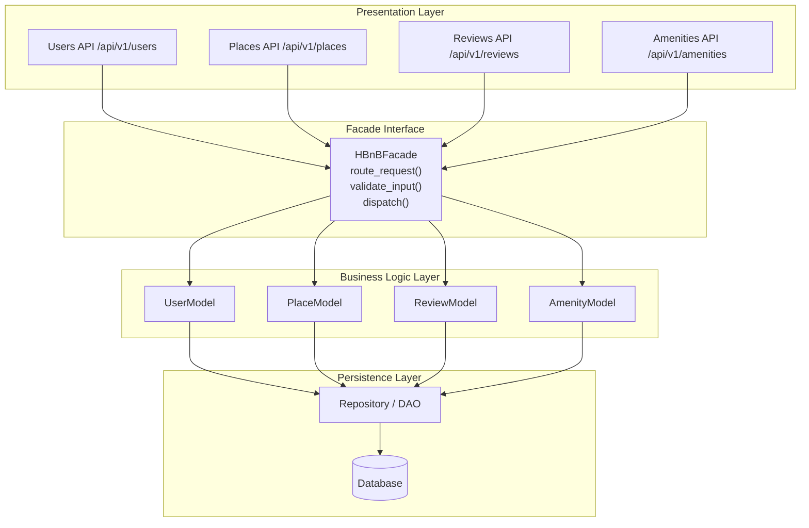
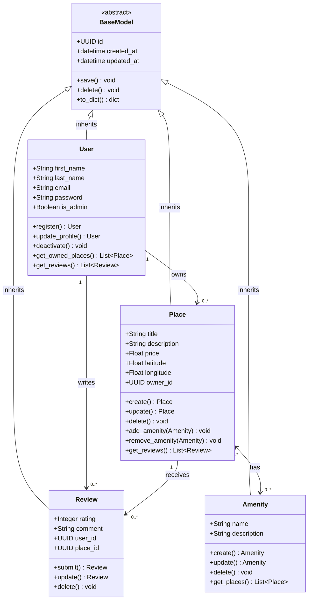
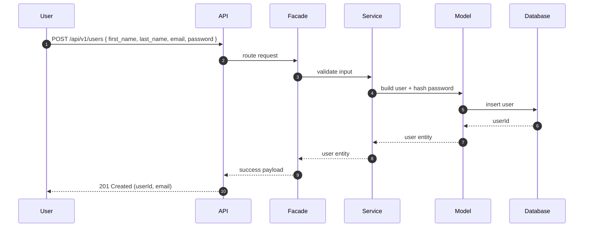
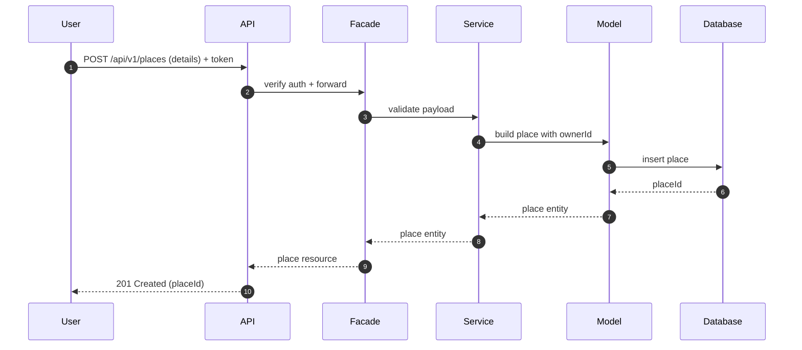
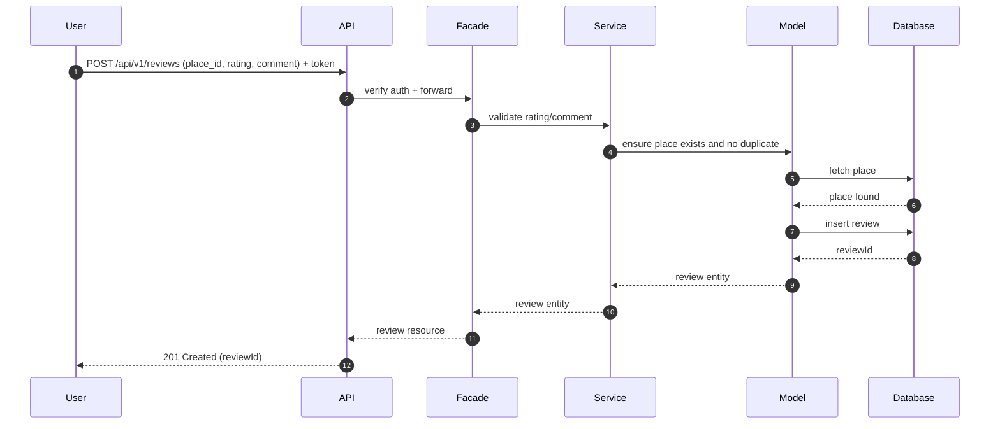
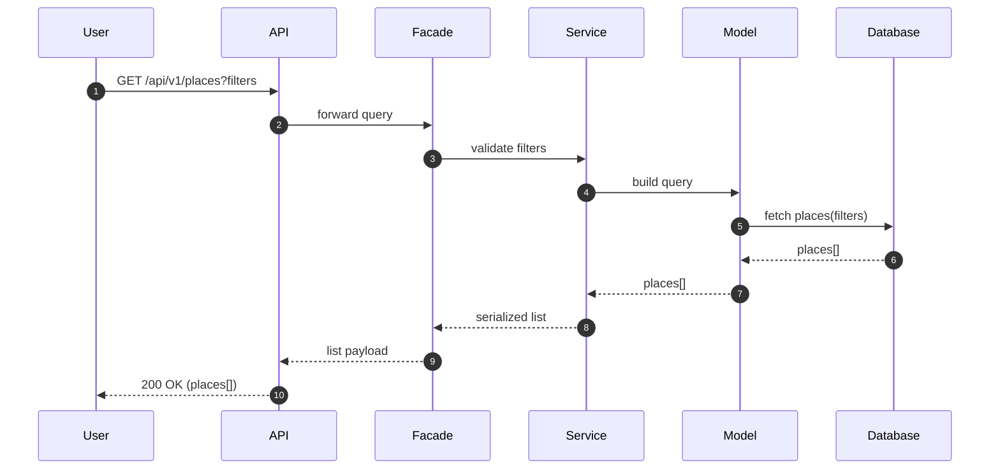

# HBnB Evolution — Technical Documentation

HBnB Evolution is a simplified Airbnb-like application. This document provides a concise blueprint of the architecture, core domain model, and key API interaction flows. All diagrams use Mermaid with neutral styling (no colors).

## 1. High-Level Architecture

## 2. Business Logic Layer — Class Diagram

## 3. API Interaction Flows — Sequence Diagrams

Participants (all diagrams): **User**, **API** (Presentation), **Facade**, **Service**, **Model**, **Database**.

### 3.1 User Registration

### 3.2 Place Creation

### 3.3 Review Submission

### 3.4 Fetch Places

---

This documentation is intentionally concise, neutral-styled, and aligned to the HBnB Evolution requirements.
