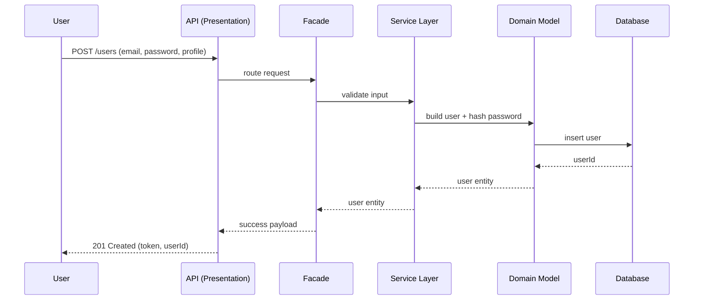
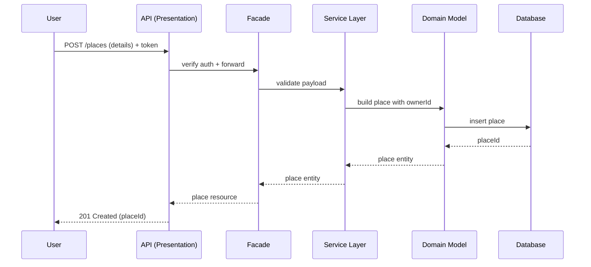
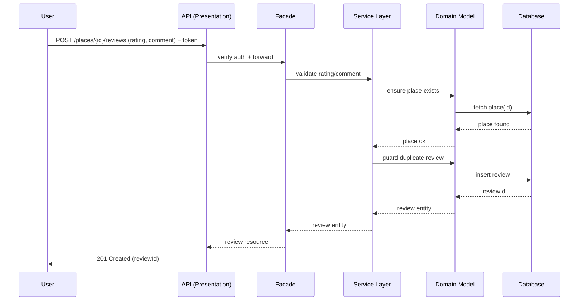
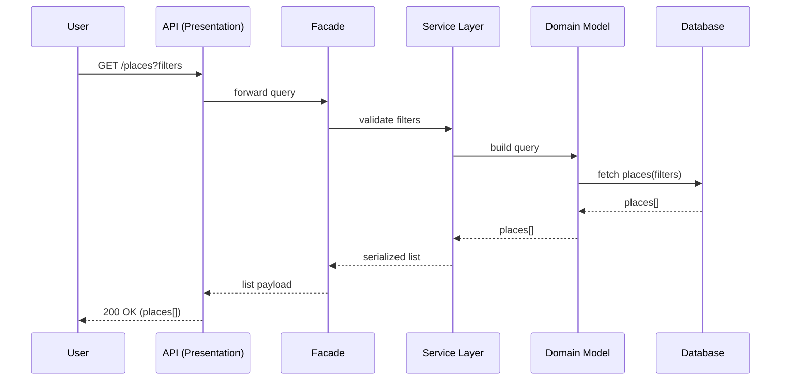

# HBnB API Sequence Diagrams

Below are Mermaid sequence diagrams for four core API calls. Each shows how the Presentation (API), Business Logic (services/models), and Persistence (database) layers collaborate. Short notes summarize the key steps.

## User Registration

## Place Creation

## Review Submission

## Fetching a List of Places

