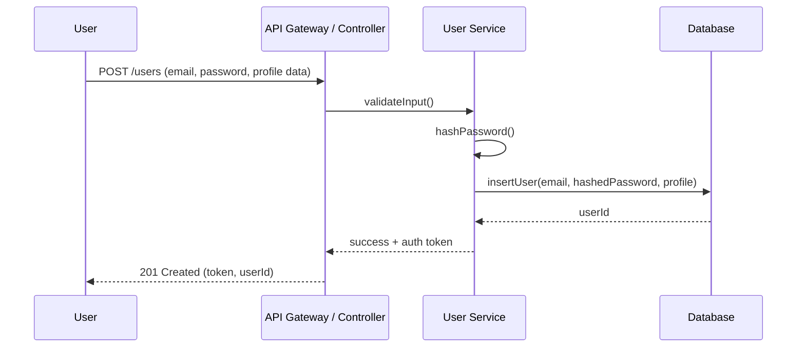
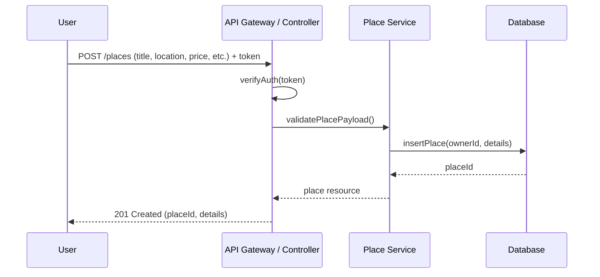
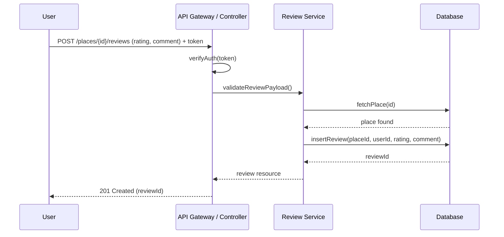
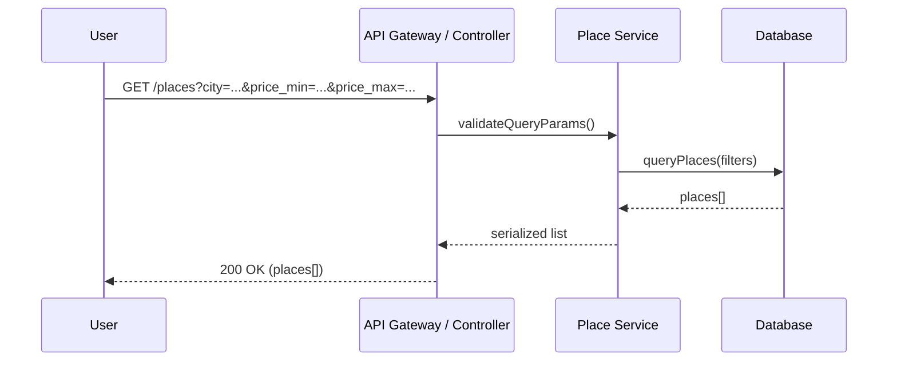

# HBnB API Sequence Diagrams

Below are Mermaid sequence diagrams for four core API calls. Each shows how the Presentation (API), Business Logic (services/models), and Persistence (database) layers collaborate. Short notes summarize the key steps.

## User Registration

User submits sign-up details. API validates, hashes the password, stores the user, and returns a token or confirmation.

## Place Creation

Authenticated user creates a new place listing. API checks auth, validates payload, persists the place, and returns the created resource.

## Review Submission

User submits a review for a place. API verifies auth, validates rating/comment, ensures place exists, then stores the review.

## Fetching a List of Places

User requests a filtered list of places (e.g., by city, price range). API validates query params, service applies filters, and returns results.

